# 리그 오브 레전드: AI 기반 라인별 골드 예측 및 기여도 분석 모델

> **챌린저 티어 경기 데이터를 활용한 XGBoost 골드 예측 모델 제작 및 플레이어 기여도를 활용한 인사이트 도출**

---

## 프로젝트 개요

| 항목 | 내용 |
|------|------|
| **프로젝트명** | AI 기반 라인별 골드 예측 및 기여도 분석 모델 |
| **목적** | 승패와 무관하게 플레이어의 경기 기여도를 객관적으로 측정 |
| **데이터** | 한국 서버 챌린저 티어 38,075 경기 (2025.01~04) |
| **모델** | XGBoost Regressor (포지션별 4개 모델) |
| **성능** | R² 99% 이상, MAE 200~300골드 |
| **핵심 지표** | 기여도 = AI 예측 골드 / 챌린저 경기 평균 골드 |

### 주요 특징

- 🎯 **승패 독립적 평가**: 승리/패배와 관계없이 개인의 순수 경기력을 측정
- 📊 **분단위 분석**: 1분 간격의 타임라인 데이터로 상세한 경기 흐름 분석
- 🔍 **SHAP 기반 해석**: 어떤 지표가 골드에 영향을 미쳤는지 설명 가능
- 📈 **시각화 대시보드**: 경기별/플레이어별 기여도 추이 시각화

### 기술 스택

```
Python | Pandas | XGBoost | SHAP | Matplotlib | Seaborn | Scikit-learn
```

---

## 목차

1. [문제 정의](#1-문제-정의-problem-definition)
2. [해결 방안](#2-해결-방안-proposed-solution)
3. [프로젝트 목표](#3-프로젝트-목표-goals)
4. [실행 환경 구성](#4-실행-환경-구성)
5. [데이터셋 설명](#5-데이터셋-설명)
6. [피처 엔지니어링](#6-피처-엔지니어링)
7. [상관관계 분석](#7-상관관계-분석-eda)
8. [모델 학습 및 평가](#8-모델-학습-및-평가)
9. [모델 해석 (SHAP 분석)](#9-모델-해석-shap-분석)
10. [기여도 분석 및 시각화](#10-기여도-분석-및-시각화)
11. [결론 및 한계점](#11-결론-및-한계점)
12. [참고 문헌](#12-참고-문헌)
---

## 1. 문제 정의 (Problem Definition)

리그 오브 레전드(LoL)에서 **경기의 승패만으로 플레이어의 실력을 평가하는 것은 한계가 있다.** 승리팀에서도 부진한 플레이어가 존재하고, 패배팀에서도 뛰어난 개인 기량을 발휘한 플레이어가 존재하기 때문이다. 따라서 **승패 결과를 배제하고, 순수하게 해당 플레이어가 경기를 얼마나 잘 수행했는지**를 객관적으로 평가할 수 있는 방법이 필요하다.

기존의 평가 방식들은 다음과 같은 한계를 가진다:

- **승패 의존적 평가**: "이겼으니까 잘한 것", "졌으니까 못한 것"이라는 단순한 결과론적 평가는 개인의 진정한 실력을 반영하지 못한다.
- **절대 지표의 한계**: 킬, 딜량, 골드 등 절대값은 경기 시간, 챔피언 특성, 팀 조합에 따라 크게 달라져 비교 기준이 되기 어렵다.
- **시간대별 맥락 부재**: 같은 5000골드라도 10분에 달성한 것과 20분에 달성한 것은 완전히 다른 의미를 가진다.
- **상대적 기준 부재**: 개인의 성과가 해당 티어/시간대에서 어느 정도 수준인지, 객관적인 기준점이 없다.

본 프로젝트는 이러한 한계를 극복하기 위해, **승패 정보를 학습에 사용하지 않고** 분단위 게임 지표만으로 플레이어의 골드를 예측하는 AI 모델을 구축한다. 예측된 골드를 챌린저 경기 평균과 비교하여 **"이 플레이어가 해당 시점에서 얼마나 잘 플레이하고 있는가?"**를 승패와 무관하게 정량적으로 측정하는 **기여도(Contribution) 지표**를 제안한다.

---

## 2. 해결 방안 (Proposed Solution)

본 프로젝트는 **분단위 타임라인 데이터**를 활용하여 다음과 같은 분석 파이프라인을 구축하였다:

### 핵심 아이디어

```
분단위 게임 지표(X) → XGBoost 모델 → 예측 골드 → 챌린저 경기 평균 대비 비율 = 기여도
```

### 7단계 분석 파이프라인

| 단계 | 노트북 | 주요 기능 |
|:---:|--------|----------|
| 1 | `01_feature_extractor.ipynb` | Raw JSON → Feature CSV 추출 |
| 2 | `02_Correlation_analysis.ipynb` | Feature-골드 상관관계 분석 |
| 3 | `03_train_model.ipynb` | XGBoost 모델 학습 |
| 4 | `04_shap_analysis.ipynb` | SHAP 기반 모델 해석 |
| 5 | `05_visualize_performance.ipynb` | 경기별 기여도 시각화 |
| 6 | `06_contribution_visualize.ipynb` | 플레이어별 기여도 산점도 |
| 7 | `07_personal_analysis.ipynb` | 개인 플레이어 추이 분석 |

### 기여도(Contribution) 정의

본 프로젝트에서 **기여도**는 다음과 같이 정의된다:

$$\text{기여도} = \frac{\text{AI 예측 골드}}{\text{챌린저 경기 평균 골드}}$$

- **1.0**: 챌린저 경기 평균 수준
- **1.2**: 챌린저 경기 평균보다 20% 높은 성과
- **0.8**: 챌린저 경기 평균보다 20% 낮은 성과

이 비율 기반 접근은 시간대, 챔피언 특성에 관계없이 **상대적 성과**를 일관된 기준으로 평가할 수 있게 한다.

---

## 3. 프로젝트 목표 (Goals)

본 프로젝트의 핵심 목표는 다음과 같다:

### 목표 1: Feature 설계 및 데이터 전처리
- 분단위 타임라인 데이터에서 **핵심 게임 지표**를 추출한다.
- BOT_DUO (원딜+서포터) 통합 처리 로직을 구현한다.

### 목표 2: 라인별 골드 예측 모델 구축
- **TOP, JUNGLE, MIDDLE, BOT_DUO** 4개 포지션별 독립 모델을 학습한다.

### 목표 3: 기여도 기반 인사이트 도출
- 경기별 승/패팀 기여도 흐름을 비교 분석한다.
- 플레이어별 평균 기여도 및 변동폭을 시각화한다.

---

## 4. 실행 환경 구성

### 4.1. 필수 라이브러리

```python
# 데이터 처리
pandas
numpy

# 시각화
matplotlib
seaborn

# 머신러닝
scikit-learn
xgboost

# 모델 해석
shap

# 유틸리티
joblib
tqdm
```

### 4.2. 디렉토리 구조

```
lol_data_analysis/
├── data/                           # 데이터 파일
│   ├── match_data/                 # Raw JSON (match_*.json, timeline_*.json)
│   ├── final_features.csv          # 전처리 완료 데이터
│   └── puuid_challengers_0408.txt  # 챌린저 PUUID 목록
├── models/                         # 학습된 XGBoost 모델 (.pkl)
├── output/                         # 분석 결과 및 시각화
│   ├── correlation_analysis/       # 상관관계 분석
│   ├── train_model/                # 모델 학습 결과
│   ├── shap_analysis/              # SHAP 분석
│   ├── visualize_performance/      # 경기별 기여도
│   └── player_contribution/        # 플레이어별 기여도
├── logs/                           # 학습 로그
└── 01~07_*.ipynb                   # 분석 노트북
```

### 4.3. 실행 순서

1. `01_feature_extractor.ipynb` - Feature 추출
2. `02_Correlation_analysis.ipynb` - 상관관계 분석
3. `03_train_model.ipynb` - 모델 학습
4. `04_shap_analysis.ipynb` - SHAP 분석
5. `05_visualize_performance.ipynb` - 경기 시각화
6. `06_contribution_visualize.ipynb` - 플레이어 기여도
7. `07_personal_analysis.ipynb` - 개인 분석

---

## 5. 데이터셋 설명

### 5.1. 데이터 출처 및 개요

- **출처**: Riot Games API (챌린저 티어 경기)
- **수집 대상**: 한국 서버(KR) 챌린저 티어 플레이어 경기
- **수집 기간**: 2025.01.08 ~ 2025.04.09

#### Raw Data EDA 요약

| 항목 | 값 |
|------|-----|
| **총 경기 수** | 38,075 경기 |
| **경기 기간** | 2025.01.08 ~ 2025.04.09 |
| **평균 경기 시간** | 28.1분 |
| **경기 시간 범위** | 20분 ~ 56분 |
| **데이터 용량** | 약 70GB |
| **Match 파일 수** | 1,075개 |
| **Timeline 파일 수** | 1,075개 |

### 5.2. Raw 데이터 

| 파일 유형 | 설명 | 평균 크기 |
|----------|------|----------|
| `match_*.json` | 경기 요약 정보 (참가자, 팀 정보, 최종 결과) | 5.8MB |
| `timeline_*.json` | 분단위 타임라인 (프레임별 스탯, 이벤트) | 60.9MB |

두 파일은 항상 **쌍(pair)**으로 처리되며, 하나의 완전한 경기 데이터를 구성한다.

#### Match 데이터 주요 필드

- `matchId`: 경기 고유 ID
- `gameCreation`, `gameStartTimestamp`, `gameEndTimestamp`: 시간 정보
- `gameDuration`: 경기 시간 (초)
- `participants`: 10명의 플레이어 정보 (각 133개 필드)
- `teamPosition`: 플레이어별 라인

#### Timeline 데이터 주요 필드

- `frameInterval`: 60000ms (1분 간격)
- `frames`: 분 단위 스냅샷 배열
- `participantFrames`: 각 플레이어의 실시간 상태 (xp, level, totalGold, minionsKilled 등)
- `events`: CHAMPION_KILL, WARD_PLACED, ELITE_MONSTER_KILL 등

### 5.3. 전처리 데이터 (final_features.csv)

| 항목 | 값 |
|------|-----|
| **총 행 수** | 8,711,944 행 |
| **컬럼 수** | 29개 |
| **시간 범위** | 1분 단위 (경기 종료까지) |

#### 주요 컬럼 구조

| 카테고리 | 컬럼 |
|----------|------|
| **메타 정보** | matchId, participantId, puuid, position, minute, win |
| **성장 지표** | xp, level, minionsKilled, jungleMinionsKilled |
| **전투 지표** | kills, deaths, assists, totalDamageDoneToChampions, totalDamageTaken |
| **운영 지표** | turretPlates, wardsPlaced, objectiveParticipation |
| **타겟 변수** | totalGold |

## 6. 피처 엔지니어링

### 6.1. 피처 선정 기준

본 프로젝트의 피처는 다음 기준으로 선정하였다:

1. **API 기본 지표 활용**: Riot Games Timeline API의 `participantFrames`에서 제공하는 분단위 스냅샷 데이터를 기반으로 한다.
2. **관련 연구 참고**: LoL 관련 논문 및 기술 블로그에서 유의미하다고 검증된 지표를 채택하였다.
3. **상대적 비교 지표 파생**: 동일 라인 상대방과의 격차(Diff)를 계산하여 상대적 성과를 측정한다.

### 6.2. 피처 설계 원칙

본 모델은 **분단위 스냅샷(Snapshot)** 데이터를 기반으로 피처를 생성한다. 각 피처는 다음 세 가지 축으로 분류된다:

| 축 | 설명 | 예시 |
|:---:|------|------|
| **성장** | 골드 수급 능력 | CS, 정글 몬스터, XP |
| **전투** | 교전 능력 및 기여 | 킬, 데스, 어시, 딜량 |
| **운영** | 맵 컨트롤 및 오브젝트 | 시야, 포탑 플레이트, 오브젝트 |

### 6.2. 모델 학습에 사용된 20개 Feature

## 지표 분류

### 원본 지표 (Riot API에서 추출) - 14개

| # | 지표 | 설명 | 출처 | URL |
|:---:|------|------|:---:|------|
| 1 | `xp` | 현재 경험치 | 4개 (논문 4) | [논문] https://arxiv.org/html/2501.10049v1, [논문] https://arxiv.org/html/2403.04873v2, [논문] https://arxiv.org/pdf/2501.10049, [논문] https://rdgain.github.io/assets/pdf/league-legends-study.pdf |
| 2 | `level` | 현재 레벨 | 4개 (논문 4) | [논문] https://arxiv.org/html/2501.10049v1, [논문] https://arxiv.org/html/2403.04873v2, [논문] https://arxiv.org/pdf/2501.10049, [논문] https://rdgain.github.io/assets/pdf/league-legends-study.pdf |
| 3 | `minionsKilled` | 미니언 처치 수 (CS) | 4개 (논문 2, 전문 분석 자료 2) | [논문] https://link.springer.com/article/10.1007/s42979-022-01660-6, [전문 분석 자료] https://www.unrankedsmurfs.com/blog/what-does-cs-mean-in-lol, [전문 분석 자료] https://dignitas.gg/articles/why-kda-doesn-t-matter-an-analysis-of-creep-score-and-why-it-s-so-important, [논문] https://arxiv.org/html/2403.04873v2 |
| 4 | `jungleMinionsKilled` | 정글 몬스터 처치 수 | 4개 (논문 2, 전문 분석 자료 2) | [논문] https://link.springer.com/article/10.1007/s42979-022-01660-6, [전문 분석 자료] https://www.unrankedsmurfs.com/blog/what-does-cs-mean-in-lol, [전문 분석 자료] https://dignitas.gg/articles/why-kda-doesn-t-matter-an-analysis-of-creep-score-and-why-it-s-so-important, [논문] https://arxiv.org/html/2403.04873v2 |
| 5 | `totalDamageDoneToChampions` | 챔피언에게 가한 총 피해량 | 4개 (논문 4) | [논문] https://arxiv.org/html/2403.04873v2, [논문] https://arxiv.org/abs/2403.04873, [논문] https://arxiv.org/html/2501.10049v1, [논문] https://scholarworks.lib.csusb.edu/cgi/viewcontent.cgi?article=2957&context=etd |
| 6 | `totalDamageTaken` | 받은 총 피해량 | 5개 (논문 5) | [논문] https://arxiv.org/html/2403.04873v2, [논문] https://arxiv.org/pdf/2501.10049, [논문] https://arxiv.org/html/2403.04873v1, [논문] https://scholarworks.lib.csusb.edu/cgi/viewcontent.cgi?article=2957&context=etd, [논문] https://www.mdpi.com/2076-3417/15/10/5241 |
| 7 | `timeEnemySpentControlled` | 적에게 CC기 적중 시간 | - | - |
| 8 | `kills` | 킬 수 (누적) | 1개 (논문 1) | [논문] https://link.springer.com/article/10.1007/s42979-022-01660-6 |
| 9 | `deaths` | 데스 수 (누적) | 3개 (논문 3) | [논문] https://arxiv.org/html/2501.10049v1, [논문] https://arxiv.org/html/2403.04873v2, [논문] https://arxiv.org/pdf/2501.10049 |
| 10 | `assists` | 어시스트 수 (누적) | 1개 (논문 1) | [논문] https://arxiv.org/pdf/2501.10049 |
| 11 | `soloKills` | 어시스트 없는 킬 수 | 3개 (논문 2, 커뮤니티 1) | [논문] https://curiosity.scholasticahq.com/article/73175-the-best-points-to-score-an-ec, [논문] https://www.researchgate.net/publication/395366238_Indexing_League_of_Legen, [커뮤니티] https://www.reddit.com/r/summonerschool/comments/cbqjnm/hi_im_a_challenge |
| 12 | `turretPlates` | 획득한 포탑 플레이트 수 | 2개 (논문 1, 전문 분석 자료 1) | [논문] https://curiosity.scholasticahq.com/article/73175-the-best-points-to-score-an-ec, [전문 분석 자료] https://rankedkings.com/blog/holding-the-line-how-to-play-top-lane-in-leagueof-legends-like-a-pro |
| 13 | `wardsPlaced` | 설치한 와드 수 | 4개 (논문 3, 전문 분석 자료 1) | [논문] https://link.springer.com/article/10.1007/s42979-022-01660-6, [논문] https://arxiv.org/html/2501.10049v1, [논문] https://curiosity.scholasticahq.com/article/73175-the-best-points-to-score-an-ec, [전문 분석 자료] https://www.invenglobal.com/articles/10112/column-enter-kiin-the-best-of-what- |
| 14 | `objectiveParticipation` | 오브젝트 참여 수 | 3개 (논문 3) | [논문] https://arxiv.org/html/2501.10049v1, [논문] https://arxiv.org/html/2403.04873v2, [논문] https://link.springer.com/article/10.1007/s42979-022-01660-6 |
| 15 | `totalGold` | 총 골드 (Target) | 10개 (논문 6, 기술 블로그 4) | [기술 블로그] https://blogoflegends.com/2020/01/10/league-of-legends-stats-carry/3/, [기술 블로그] https://medium.com/data-science/lol-match-prediction-using-early-laning-phase-data-machine-learning-4c13c12852fa, [논문] https://arxiv.org/html/2403.04873v2, [논문] https://arxiv.org/html/2501.10049v1, [기술 블로그] https://dev.to/allands/how-machine-learning-made-me-win-more-on-league-of-legends-3on5, [논문] http://arno.uvt.nl/show.cgi?fid=161690, [논문] https://arxiv.org/abs/2403.04873, [논문] https://arxiv.org/pdf/2403.04873.pdf, [논문] https://www.jsr.org/hs/index.php/path/article/download/2851/1453/24541, [기술 블로그] https://alubanana.github.io/data%20science/machine%20learning/columbia/python/r/regression/deep%20learning/LOL-Analysis/ |

### 파생 지표 (직접 계산) - 8개

| # | 지표 | 계산 방식 | 출처 | URL |
|:---:|------|-----------|:---:|------|
| 1 | `xpDiff` | 상대 라이너와의 XP 격차 | 3개 (논문 1, 기술 블로그 2) | [기술 블로그] https://alubanana.github.io/data%20science/machine%20learning/columbia/python/r/regression/deep%20learning/LOL-Analysis/, [기술 블로그] https://zijiemei.medium.com/league-of-legends-win-analysis-ff6310152430, [논문] https://rdgain.github.io/assets/pdf/league-legends-study.pdf |
| 2 | `csDiff` | 상대 라이너와의 CS 격차 | 8개 (논문 4, 기술 블로그 2, 전문 분석 자료 2) | [논문] https://link.springer.com/article/10.1007/s42979-022-01660-6, [전문 분석 자료] https://www.unrankedsmurfs.com/blog/what-does-cs-mean-in-lol, [전문 분석 자료] https://dignitas.gg/articles/why-kda-doesn-t-matter-an-analysis-of-creep-score-and-why-it-s-so-important, [논문] https://arxiv.org/html/2403.04873v2, [논문] https://arxiv.org/html/2501.10049v1, [논문] https://rdgain.github.io/assets/pdf/league-legends-study.pdf, [기술 블로그] https://esportstalk.wordpress.com/, [기술 블로그] https://blog.devgenius.io/developing-algorithms-to-identify-exceptional-leagueof-legends-players-using-koreas-lck-data-dccdf552cb2e |
| 3 | `damageDiff` | 상대 라이너와의 딜량 격차 | - | - |
| 4 | `killsDiff` | 상대 라이너와의 킬 격차 | - | - |
| 5 | `levelDiff` | 상대 라이너와의 레벨 격차 | - | - |
| 6 | `KDA` | (킬 + 어시) / max(1, 데스) | 5개 (논문 5) | [논문] https://arxiv.org/html/2501.10049v1, [논문] https://arxiv.org/html/2403.04873v2, [논문] https://arxiv.org/pdf/2501.10049, [논문] https://www.lancaster.ac.uk/~romano/files/amy_dissertation.pdf, [논문] https://www.researchgate.net/publication/395366238_Indexing_League_of_Legen |
| 7 | `killParticipation` | 팀 킬 중 참여 비율 | 2개 (논문 1, 전문 분석 자료 1) | [전문 분석 자료] https://www.leaguemath.com/kill-participation-by-role/, [논문] https://arxiv.org/html/2501.10049v1 |
| 8 | `damageShare` | 팀 딜량 중 본인 비율 | 1개 (논문 1) | [논문] https://www.mdpi.com/2076-3417/15/10/5241 |


### 6.3. BOT_DUO 통합 처리

바텀 라인은 원딜과 서포터가 함께 플레이하는 2v2 구도이므로, 두 플레이어의 스탯을 다음과 같이 통합한다:

| 처리 방식 | 해당 컬럼 |
|----------|----------|
| **합산** | kills, deaths, assists, minionsKilled, totalDamage*, xpDiff, csDiff 등 |
| **평균** | xp, level |
| **재계산** | KDA, killParticipation, damageShare (합산 후 다시 계산) |

---

## 7. 상관관계 분석 (EDA)

### 7.1. Feature-골드 상관관계

모델 학습 전, 각 Feature와 타겟 변수(totalGold) 간의 상관관계를 분석하였다.

#### Feature 간 상관관계 행렬 (TOP 라인 기준)

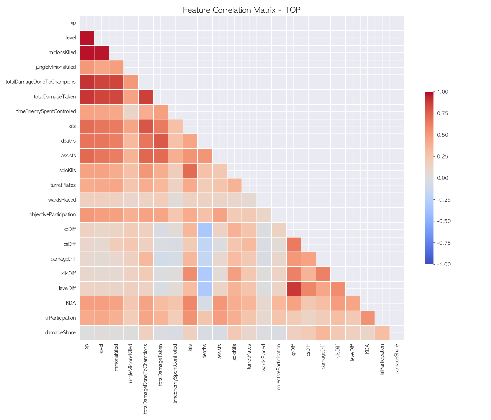

*<그림 1: TOP 라인 Feature 간 상관관계 히트맵>*

**주요 발견사항:**
- `xp`와 `totalGold` 간 매우 높은 양의 상관관계 (0.9+)를 보인다.
- `minionsKilled`와 골드 간 강한 양의 상관관계가 존재한다.
- `deaths`와 골드 간 음의 상관관계가 나타난다. (사망 시 골드 손실)

### 7.2. 주요 Feature 중요도

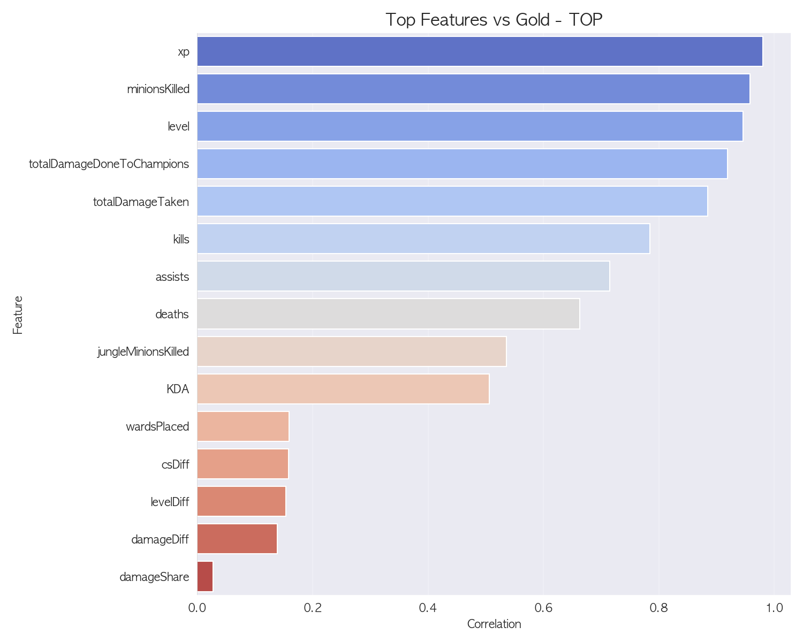

*<그림 2: 골드와 가장 높은 상관관계를 보이는 Feature>*

**TOP 라인 기준 상위 Feature:**
1. `xp` - 경험치
2. `minionsKilled` - CS
3. `totalDamageDoneToChampions` - 딜량
4. `kills` - 킬 수
5. `turretPlates` - 포탑 플레이트

### 7.3. 시간대별 상관관계 변화

경기가 진행됨에 따라 각 Feature의 중요도가 어떻게 변화하는지 분석하였다.

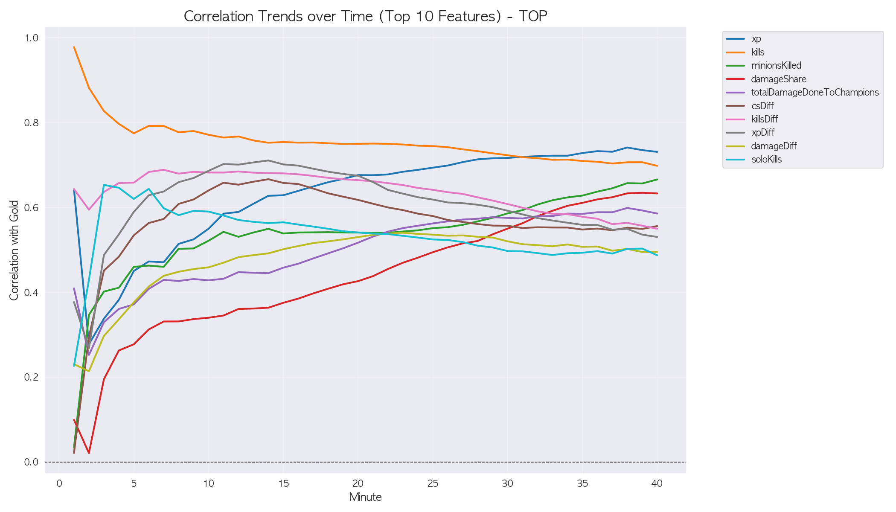

*<그림 3: 시간에 따른 주요 Feature 상관관계 변화>*

**주요 발견사항:**
- **초반(1~10분)**: kill이 초반에는 압도적인 중요도를 차지한다.
- **중반(10~20분)**: solo킬, cs diff 의 중요도가 떨어진다.
- **후반(20분~)**: damageShare(팀 딜량 중 본인 비율)의 중요도가 상승한다.

---

## 8. 모델 학습 및 평가

### 8.1. 모델 선택: XGBoost Regressor

본 프로젝트에서 **골드 예측 모델**로 XGBoost Regressor를 선택한 주요 근거는 다음과 같다:

| 장점 | 설명 |
|------|------|
| **높은 예측 성능** | Gradient Boosting의 최적화된 구현체로, 복잡한 비선형 관계 학습에 효과적이다. |
| **과적합 방지** | L1/L2 정규화, 서브샘플링 등 내장된 정규화 기법을 제공한다. |
| **Feature 중요도** | 모델 해석을 위한 Feature Importance를 제공한다. |
| **효율성** | 병렬 처리 지원으로 대규모 데이터셋에서도 빠른 학습이 가능하다. |

### 8.2. 학습 설정

```python
XGBRegressor(
    n_estimators=1000,
    learning_rate=0.1,
    max_depth=6,
    subsample=0.8,
    colsample_bytree=0.8,
    tree_method='hist',      # 메모리 효율화
    early_stopping_rounds=50 # 과적합 방지
)
```

**데이터 분할:**
- **GroupShuffleSplit** 사용 (matchId 기준)
- Train:Test = 80:20
- 동일 경기의 여러 시점이 분산되지 않도록 보장하였다.

### 8.3. 모델 성능 결과

| 포지션 | MAE (골드) | RMSE (골드) | R² |
|:------:|:----------:|:-----------:|:----:|
| **TOP** | 229.27 | 374.06 | **0.9908** |
| **JUNGLE** | 203.88 | 312.79 | **0.9940** |
| **MIDDLE** | 225.76 | 362.84 | **0.9916** |
| **BOT_DUO** | 325.23 | 501.61 | **0.9946** |

> **성능 해석:**
> - 모든 라인에서 **R² 99% 이상**의 뛰어난 예측 성능을 달성하였다.
> - MAE 기준 평균 약 **200~300 골드** 오차를 보인다. (한 킬 = 300골드 고려 시 매우 정확함)
> - JUNGLE 라인이 가장 낮은 오차를 보이며, 정글러 활동 패턴이 비교적 예측 가능함을 시사한다.
> - BOT_DUO는 두 명 합산으로 인해 절대적 MAE/RMSE는 높지만 R²는 가장 높다.

### 8.4. Feature Importance

| TOP | JUNGLE |
|:---:|:---:|
|  | 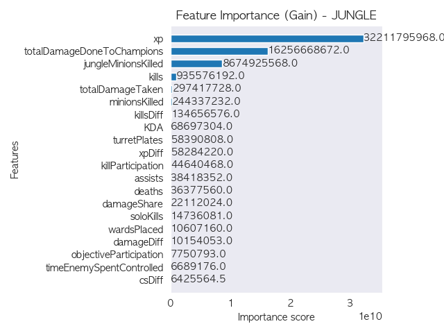 |
| **MIDDLE** | **BOT_DUO** |
| 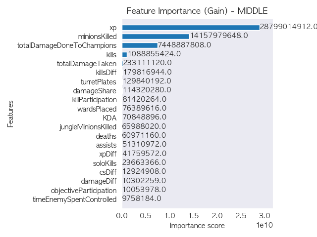 | 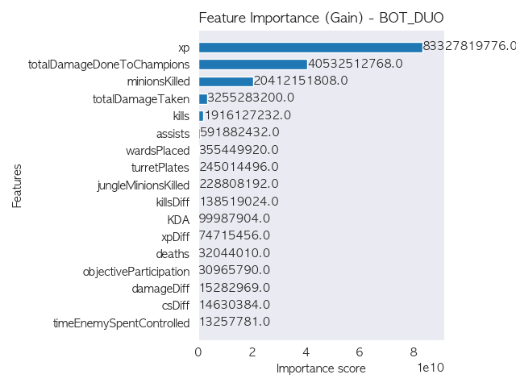 |

*<그림 4: 라인별 모델 Feature 중요도>*

**모든 라인 공통 상위 Feature:**
1. `xp` - 경험치 (가장 중요)
2. `minionsKilled` - CS
3. `totalDamageDoneToChampions` - 딜량
4. `kills` - 킬 수


---

## 9. 모델 해석 (SHAP 분석)

### 9.1. SHAP 개요

**SHAP (SHapley Additive exPlanations)**은 각 Feature가 개별 예측에 얼마나 기여했는지를 설명하는 해석 기법이다. 이를 통해 "왜 이 플레이어의 예측 골드가 높은가?"에 대한 답을 얻을 수 있다.

| 분석 방법 | 특징 | 한계 |
|:---:|------|------|
| **상관관계** | Feature와 타겟 간 선형 관계 측정 | 다른 Feature와의 상호작용 미반영 |
| **Gain** | 모델 내부 분기 기준 중요도 | 학습 데이터에 의존적, 일관성 부족 |
| **SHAP** | 각 샘플별 Feature별 기여도 계산 | 모든 Feature 조합을 고려한 공정한 기여도 |

> SHAP은 게임이론의 Shapley Value를 기반으로, **다른 Feature들과의 상호작용을 모두 고려**하여 개별 예측에 대한 각 Feature의 기여도를 공정하게 배분한다.

### 9.2. Feature 중요도 (SHAP Summary)

| TOP | JUNGLE |
|:---:|:---:|
| 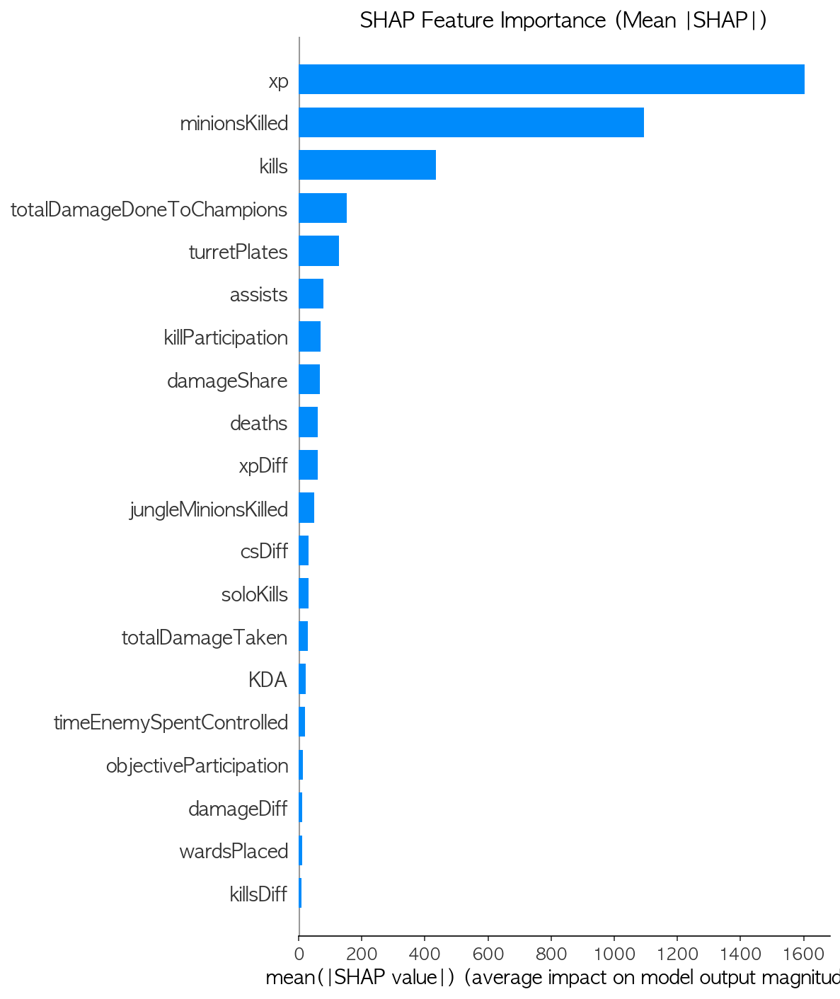 | 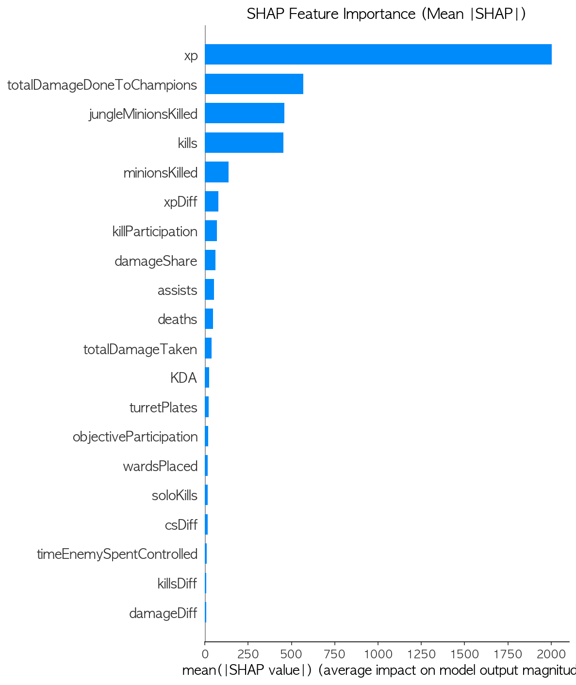 |
| **MIDDLE** | **BOT_DUO** |
| 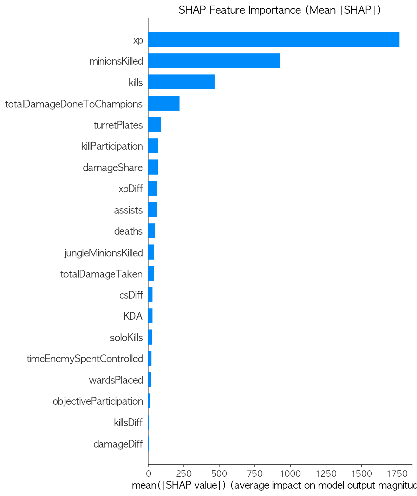 |  |

*<그림 6: 라인별 평균 |SHAP| 값 기준 Feature 중요도>*


## 10. 기여도 분석 및 시각화

### 10.1. 기여도(Contribution) 계산 방식

본 프로젝트의 핵심인 **기여도**는 다음 3단계로 계산된다:

```python
# 1단계: 챌린저 경기 평균 골드 계산 (분단위 기준점)
global_mean_gold = df.groupby('minute')['totalGold'].mean().to_dict()

# 2단계: AI 예측 골드 (모델 출력)
df['predictedGold'] = model.predict(X)

# 3단계: 기여도 Ratio 계산
df['contribution'] = df['predictedGold'] / df['minute'].map(global_mean_gold)
```

| 기여도 값 | 해석 |
|:---------:|------|
| 1.0 | 챌린저 경기 평균 수준 |
| 1.2 | 평균보다 20% 높은 성과 |
| 0.8 | 평균보다 20% 낮은 성과 |

### 10.2. 경기별 기여도 시각화

개별 경기에서 승리팀과 패배팀의 기여도 추이를 비교 분석한다.

**시각화 해석 방법:**
- **파란선 (승리팀)**: 승리한 팀의 기여도 추이
- **빨간선 (패배팀)**: 패배한 팀의 기여도 추이
- **실선**: 실제 골드 기반 기여도
- **점선**: AI 예측 골드 기반 기여도

| TOP | JUNGLE |
|:---:|:---:|
| 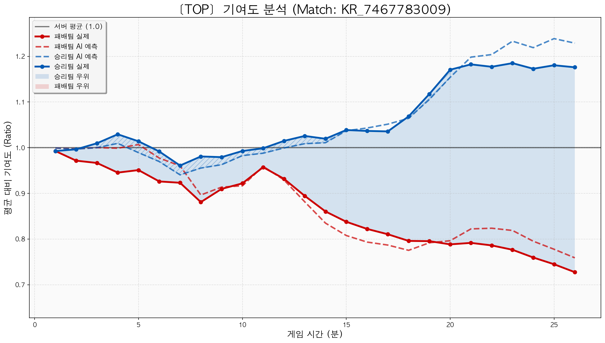 | 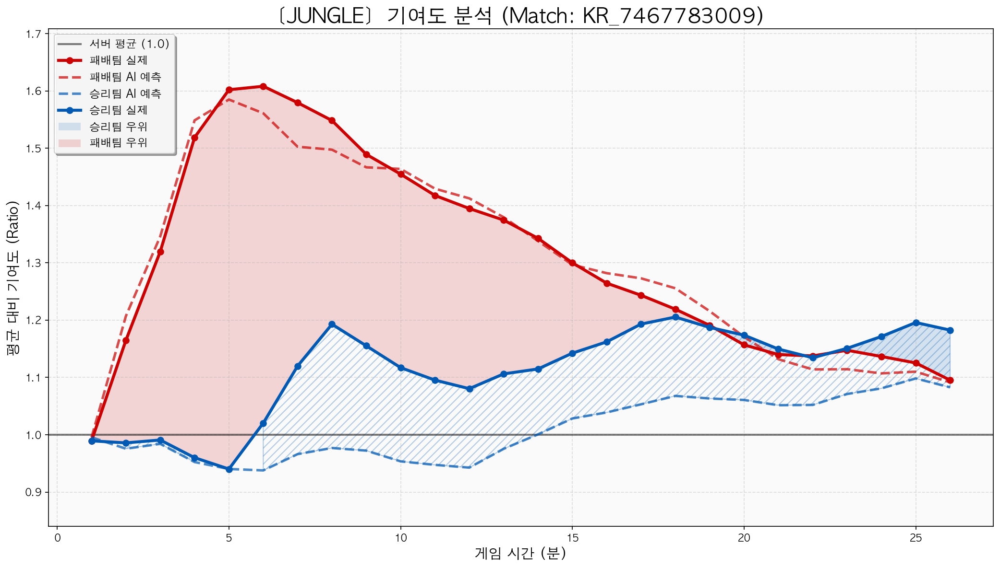 |
| **MIDDLE** | **BOT_DUO** |
| 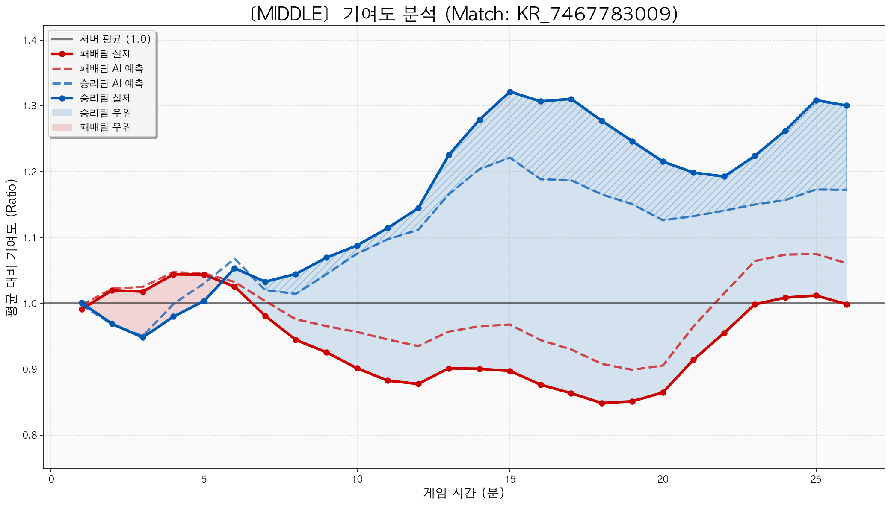 | 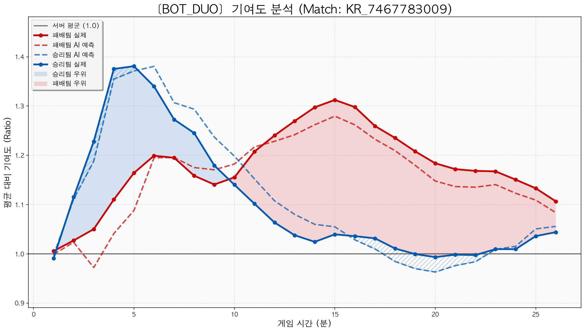 |

*<그림 9: 라인별 경기 기여도 분석 - Match KR_7467783009 (승리팀 파랑 vs 패배팀 빨강)>*

### 10.3. 개인 플레이어 시계열 분석

`07_personal_analysis.ipynb`를 통해 특정 플레이어(PUUID 기준)의 기여도 변화를 시간순으로 분석한다.

**분석 조건:**
- 해당 포지션에서 **최소 10경기 이상** 플레이한 경우만 분석
- 기여도 = AI 예측 골드 / 챌린저 전체 평균 골드 (1.0 = 평균)

#### 시각화 1: 기여도 타임라인

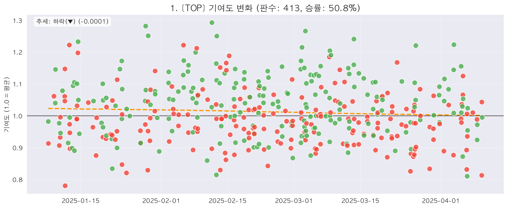

*<그림 10: TOP 포지션 개인 기여도 변화 추이>*

- **초록점**: 승리 경기
- **빨간점**: 패배 경기
- **점선**: 기여도 상승/하락 추세선
- **검은 실선**: 챌린저 평균 (1.0)

#### 시각화 2: 골드 획득량 비교

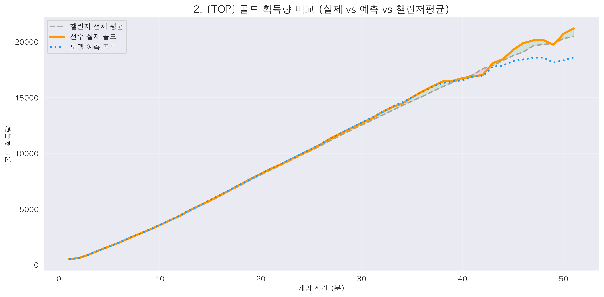

*<그림 11: 선수 실제 골드 vs 예측 골드 vs 챌린저 평균 비교>*

- **주황색 실선**: 선수의 실제 평균 골드
- **파란색 점선**: AI 모델 예측 골드
- **회색 점선**: 챌린저 전체 평균 골드
- **녹색 영역**: 평균 이상 구간
- **빨간 영역**: 평균 이하 구간

**활용 예시:**
- 특정 플레이어의 시간에 따른 실력 변화 추적
- 포지션별 승률과 기여도의 상관관계 분석
- 안정적인 캐리형인지, 기복이 큰 타입인지 파악

### 10.4. 플레이어별 기여도 분석

플레이어 개인의 **평균 기여도**와 **경기력 변동폭**을 산점도로 시각화한다.


*<그림 12: 정글러 기여도 산점도>*

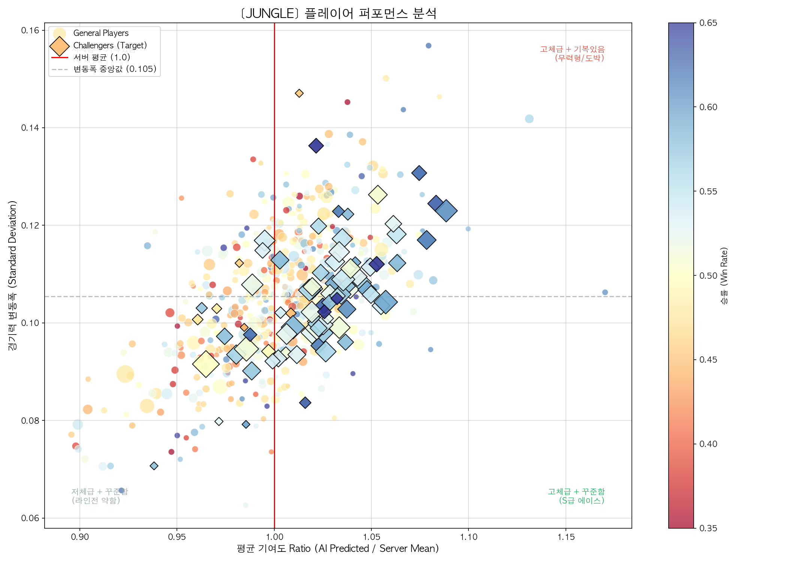

*<그림 13: 챌린저(다이아몬드) 표시된 정글러 기여도 산점도>*

**그래프 해석** 
- 확실히 챌린저인 플레이어가 더 높은 평균 기여도를 보이는 경향이 있다.
- 기여도가 높아질수록 변동폭도 커지는 경향이 보인다.

**축 해석:**
- **X축 (평균 기여도)**: 플레이어의 평균적인 기여도 Ratio
  - 1.0 이상: 챌린저 경기 평균 이상의 성과
  - 1.0 미만: 챌린저 경기 평균 이하의 성과
- **Y축 (변동폭)**: 경기별 기여도의 표준편차
  - 낮을수록: 안정적인 플레이어
  - 높을수록: 기복이 큰 플레이어
- **색상**: 승률 (파랑→빨강 = 낮음→높음)
- **크기**: 플레이 횟수 (클수록 경기 수 많음)
  - **모양**: 다이아몬드는 2025.04.08 기준 챌린저 유저

**이상적인 플레이어 유형:**
- **오른쪽 하단**: 높은 평균 기여도 + 낮은 변동폭 = **안정적인 캐리형**
- **오른쪽 상단**: 높은 평균 기여도 + 높은 변동폭 = **하이리스크 캐리형**

---

## 11. 결론 및 한계점

### 11.1. 핵심 인사이트

본 프로젝트를 통해 다음과 같은 인사이트를 도출하였다:

1. **R² 99% 이상의 정확한 골드 예측**: XGBoost 모델이 분단위 게임 지표만으로 플레이어의 골드를 매우 정확하게 예측할 수 있음을 입증하였다.
2. **XP가 가장 중요한 지표**: 모든 라인에서 경험치(XP)가 골드 예측에 가장 큰 영향을 미친다.
3. **시간대별 중요 지표 변화**: 초반에는 Kill 수, 후반에는 경험치(XP)획득량이 중요해진다.
4. **기여도 비율 기반 분석의 유용성**: 절대적 골드 대신 챌린저 경기 평균 대비 비율을 사용함으로써 시간/챔피언에 무관한 일관된 평가가 가능하다.

### 11.2. 프로젝트의 의의

- **객관적 플레이어 평가**: 주관적 판단이 아닌 AI 예측 기반의 객관적 기여도 측정이 가능하다.
- **코칭/리뷰 도구**: 경기 복기 시 어느 라인이 얼마나 기여했는지 정량적 분석이 가능하다.
- **플레이어 성향 파악**: 평균 기여도와 변동폭을 통해 플레이어의 플레이 스타일 및 추세를 파악할 수 있다.

### 11.3. 한계점

| 한계점             | 설명                                                         |
|-----------------|------------------------------------------------------------|
| **오브젝트 데이터 부족** | 용, 바론 등 오브젝트 획득이 직접적으로 반영되지 않았다.                           |
| **팀 단위 운영**     | 챔피언 간 시너지, 카운터 관계가 고려되지 않았다.스플릿 푸시, 한타 설계 등 거시적 전략이 미반영되었다. |
| **제압 골드 미반영**   | 킬/어시스트 시 획득하는 제압 골드가 반영되지 않아 실제 획득 골드와 예측 골드간 간극이 벌어졌다.    |

### 11.4. 향후 개선 방향

1. **챔피언/조합 피처 추가**: 챔피언 역할군, CC기 보유량, 팀 조합 점수 등을 피처로 추가한다.
2. **오브젝트 이벤트 반영**: 용/바론 획득 여부를 플래그로 추가하여 운영 가치를 정량화한다.
3. **시계열 모델 도입**: LSTM 등 시계열 딥러닝 모델로 경기 흐름의 '모멘텀'을 예측한다.
4. **통합 대시보드 구축**: 실시간 경기 분석 및 플레이어 성향 조회가 가능한 웹 인터페이스를 개발한다.

---

## 12. 참고 문헌

### 논문 (Academic Papers)

| # | 제목/출처 | URL |
|:---:|----------|-----|
| 1 | arXiv - LoL Match Prediction | https://arxiv.org/html/2501.10049v1 |
| 2 | arXiv - Game Analytics | https://arxiv.org/html/2403.04873v2 |
| 3 | arXiv - LoL Data Analysis | https://arxiv.org/abs/2403.04873 |
| 4 | Springer - Player Performance | https://link.springer.com/article/10.1007/s42979-022-01660-6 |
| 5 | MDPI - Applied Sciences | https://www.mdpi.com/2076-3417/15/10/5241 |
| 6 | CSUSB ScholarWorks | https://scholarworks.lib.csusb.edu/cgi/viewcontent.cgi?article=2957&context=etd |
| 7 | Lancaster University Dissertation | https://www.lancaster.ac.uk/~romano/files/amy_dissertation.pdf |
| 8 | Tilburg University | http://arno.uvt.nl/show.cgi?fid=161690 |
| 9 | Journal of Student Research | https://www.jsr.org/hs/index.php/path/article/download/2851/1453/24541 |
| 10 | RDGain - LoL Study | https://rdgain.github.io/assets/pdf/league-legends-study.pdf |
| 11 | Scholastica - Best Points to Score | https://curiosity.scholasticahq.com/article/73175-the-best-points-to-score-an-ec |
| 12 | ResearchGate - Indexing LoL | https://www.researchgate.net/publication/395366238_Indexing_League_of_Legen |

### 기술 블로그 (Technical Blogs)

| # | 제목/출처 | URL |
|:---:|----------|-----|
| 1 | Medium - LoL Match Prediction | https://medium.com/data-science/lol-match-prediction-using-early-laning-phase-data-machine-learning-4c13c12852fa |
| 2 | Dev.to - ML for LoL | https://dev.to/allands/how-machine-learning-made-me-win-more-on-league-of-legends-3on5 |
| 3 | GitHub Pages - LoL Analysis | https://alubanana.github.io/data%20science/machine%20learning/columbia/python/r/regression/deep%20learning/LOL-Analysis/ |
| 4 | Medium - Win Analysis | https://zijiemei.medium.com/league-of-legends-win-analysis-ff6310152430 |
| 5 | Blog of Legends | https://blogoflegends.com/2020/01/10/league-of-legends-stats-carry/3/ |
| 6 | DevGenius - LCK Data | https://blog.devgenius.io/developing-algorithms-to-identify-exceptional-leagueof-legends-players-using-koreas-lck-data-dccdf552cb2e |
| 7 | Esports Talk | https://esportstalk.wordpress.com/ |

### 전문 분석 자료 (Professional Analysis)

| # | 제목/출처 | URL |
|:---:|----------|-----|
| 1 | Unranked Smurfs - CS Guide | https://www.unrankedsmurfs.com/blog/what-does-cs-mean-in-lol |
| 2 | Dignitas - CS Importance | https://dignitas.gg/articles/why-kda-doesn-t-matter-an-analysis-of-creep-score-and-why-it-s-so-important |
| 3 | Ranked Kings - Top Lane Guide | https://rankedkings.com/blog/holding-the-line-how-to-play-top-lane-in-leagueof-legends-like-a-pro |
| 4 | Inven Global - Kiin Analysis | https://www.invenglobal.com/articles/10112/column-enter-kiin-the-best-of-what- |
| 5 | League Math - Kill Participation | https://www.leaguemath.com/kill-participation-by-role/ |
